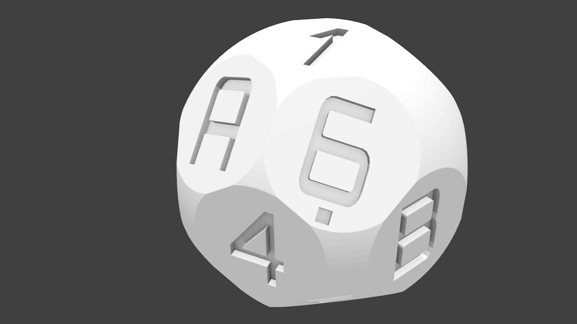

OpenSCAD script to generate a sixteen sided "spherical cap" style hexadecimal die. [Download the STL file](./sixteen-sided-hexidecimal-die.stl) to print.

Hopefully useful for generating private keys and the like. Author gives no guarantee of any statistical properties of the randomness of this die. You probably want to use other sources of entropy in combination with this.

Based on a script [Thingiverse by bwarne](http://www.thingiverse.com/thing:58408/#files).
