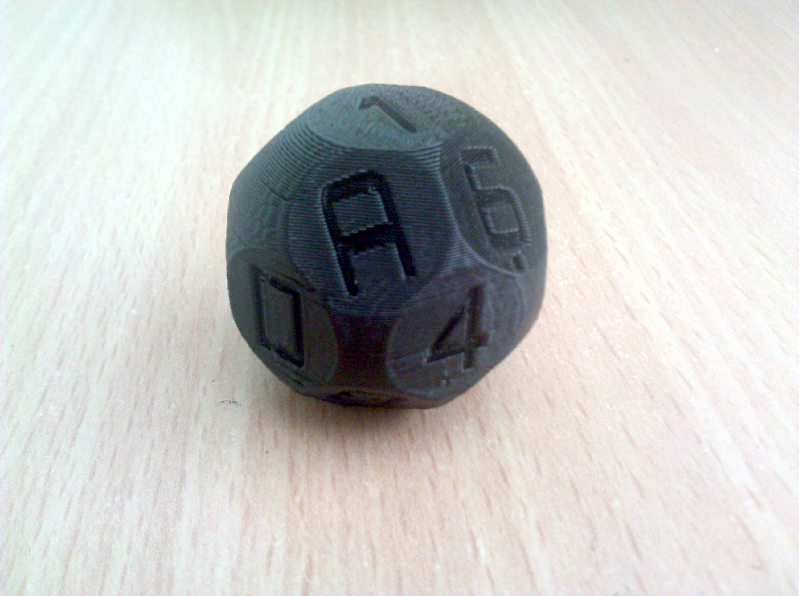

This is a fork by [Samourai Wallet](https://samouraiwallet.com/), adding the logo in place of the "A" side of the dice.

### Old README

OpenSCAD script to generate a sixteen sided "spherical cap" style hexadecimal die. [Download the STL file](./sixteen-sided-hexidecimal-die.stl) to print.

Hopefully useful for generating private keys and the like. Author gives no guarantee of any statistical properties of the randomness of this die. You probably want to use other sources of entropy in combination with this. What if the NSA have backdoored your 3d printer with an infill-biasing algorithm that causes your die to be weighted statistically in favour of certain values? Pwned.

Based on a modified script from [Thingiverse by bwarne](http://www.thingiverse.com/thing:58408/#files).
